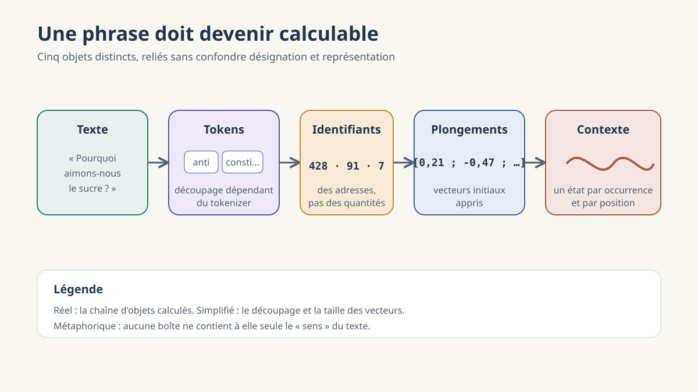

**Une phrase dans la machine — Partie 1/4.** Nous partons de ce que nous écrivons et suivons sa transformation jusqu'à l'entrée du modèle. Avant qu'une réponse puisse apparaître, le texte doit devenir calculable.

# Comment le texte arrive au modèle ?

*Des unités de langage aux représentations calculables*

## La phrase à l'écran

Vous écrivez : « Pourquoi aimons-nous le sucre ? » À l'écran, la phrase paraît entière. Nous y reconnaissons des mots, une question, peut-être déjà une intention. Le système informatique reçoit d'abord autre chose : une suite de caractères encodés, c'est-à-dire associés à des nombres selon une convention comme Unicode, puis préparés pour le modèle.

Cette première numérisation ne suffit pas. Elle permet d'enregistrer et de transmettre le texte ; elle ne fournit pas encore les unités sur lesquelles le réseau a appris à calculer. Il faut distinguer ce que nous lisons et ce que le modèle traite. Nous voyons une phrase. Lui reçoit une suite ordonnée d'unités converties en vecteurs.

Voilà le passage que nous allons suivre. Non pas pour réduire le langage à une mécanique, mais pour comprendre précisément à quel moment la mécanique commence.

*Schéma simplifié. Le découpage exact dépend du tokenizer ; les vecteurs sont des objets mathématiques de grande dimension, non des boîtes contenant le sens.*

## Le modèle ne reçoit pas des mots

Notre lecture découpe spontanément la phrase en mots. Ce découpage n'est pourtant pas assez robuste pour une machine qui doit traiter des noms propres, des fautes, des langues multiples et des formes jamais rencontrées. Très bien. Mais que faire d'« anticonstitutionnellement », d'un terme scientifique rare ou d'un mot inventé dans une cour de récréation ? Un vocabulaire contenant toutes les formes possibles serait impossible à fermer.

Un *tokenizer* applique donc une procédure de découpage. Il transforme le texte en **tokens**, des unités qui peuvent correspondre à un mot entier, une partie de mot, un signe de ponctuation ou même, selon la méthode, à des fragments liés aux octets du texte. Les formes fréquentes ont davantage de chances de tenir en une seule unité ; les formes rares sont souvent fragmentées. Pour « anticonstitutionnellement », un exemple pédagogique pourrait isoler plusieurs morceaux. Ce découpage est simplifié : un autre tokenizer produirait d'autres frontières.

Le tokenizer est généralement un prétraitement distinct du réseau neuronal. Son vocabulaire et ses règles sont arrêtés pour un modèle donné. Deux modèles peuvent donc recevoir des suites de tokens différentes à partir de la même phrase. Le token n'est pas une définition du mot. C'est une unité de travail.

Cette distinction a une conséquence discrète. Une entrée du vocabulaire n'est pas encore une occurrence dans une phrase. Le vocabulaire contient, une fois, l'unité disponible ; la phrase peut l'utiliser zéro, une ou plusieurs fois, à des positions différentes. C'est sur ces occurrences ordonnées que le calcul va porter.

## Un numéro qui ne signifie rien

À chaque token du vocabulaire correspond un **identifiant**, un nombre entier. Imaginons que l'unité « chat » porte le numéro 428. Ce nombre ne mesure rien. Il ne dit ni que le chat est un animal, ni qu'il ressemble davantage au chien qu'au carburateur. Il sert à retrouver une entrée.

La meilleure image est celle du vestiaire. Le ticket 428 ne contient aucune propriété du manteau. Il indique le bon casier. De même, l'identifiant désigne un token sans encore le représenter d'une manière utile au calcul.

Il faut donc séparer désignation et représentation. L'identifiant 428 n'est pas une quantité sur laquelle le modèle raisonnerait : le token 428 n'est pas plus grand, plus abstrait ou plus important que le token 127. Changer l'ordre arbitraire des tickets, puis déplacer les casiers de la même manière, ne changerait pas le mécanisme.

Cette opération paraît presque administrative. Elle est pourtant nécessaire. Le texte a été découpé en unités ; chacune possède désormais une adresse stable. Reste à ouvrir le casier.

## Le casier contient un vecteur

Dans le casier se trouve une ligne de nombres. Le modèle possède une **matrice de plongement** : un tableau avec, en simplifiant, une ligne par token du vocabulaire. L'identifiant permet d'en extraire la ligne correspondante. Cette suite de valeurs est un **vecteur de plongement**, ou *embedding*.

Pourquoi remplacer une unité de texte par quelques milliers de nombres ? Parce que le réseau ne peut pas multiplier ou additionner un mot, tandis qu'il peut transformer un vecteur. Les coordonnées n'ont pas chacune une étiquette lisible. La dimension 317 n'est pas le tiroir de « l'animalité », pas plus que la dimension 918 ne contient le passé. C'est la configuration de nombreuses valeurs, et surtout leurs relations avec d'autres configurations, qui devient utile au calcul.

Le ticket et le casier évitent ici une confusion précise. L'identifiant choisit la ligne ; le vecteur est cette ligne. Le premier est un index. Le second est une représentation numérique. Dire seulement que « les mots deviennent des nombres » efface la différence entre ces deux opérations.

On dit parfois que le vecteur contient le sens du token. La formule promet trop. Il fournit un point de départ appris pour la prédiction. Il ne constitue ni une définition de dictionnaire ni la preuve d'une expérience intérieure. Les nombres ne sont pas pour autant un code arbitraire dépourvu de structure : l'entraînement les a organisés afin qu'ils deviennent utiles dans les calculs suivants.

## Une carte apprise, pas un dictionnaire

Au début de l'entraînement, les coordonnées ne sont pas écrites par un linguiste. Elles sont ajustées avec les autres paramètres lorsque le modèle compare ses prédictions aux suites observées dans son corpus. Erreur après erreur, de petites corrections modifient un grand nombre de valeurs. Pour un modèle dont les paramètres sont ensuite fixés, la ligne associée à un token reste stable ; elle a pourtant une histoire, celle de ces ajustements.

Des tokens employés dans des contextes partiellement semblables peuvent ainsi acquérir des représentations qui entretiennent certaines relations géométriques. « Chat » et « chien » apparaissent auprès de verbes et de situations qui se recouvrent : on les nourrit, ils dorment, ils courent, ils occupent parfois le clavier avec une remarquable indifférence au travail en cours. Aucune règle n'a déclaré qu'ils appartenaient à la même catégorie. Une régularité d'usage a contribué à organiser leurs coordonnées.

On pourrait objecter que parler de carte donne l'illusion d'un atlas du sens. L'objection est juste. Une projection en deux dimensions écrase presque toute l'information d'un espace qui en possède des milliers. La proximité reflète des distributions d'emploi, pas une essence : des antonymes comme « chaud » et « froid » peuvent être voisins parce qu'ils fréquentent les mêmes phrases. Des directions interprétables ont bien été observées dans certains plongements, mais elles restent approximatives, dépendantes des données et de la méthode. Elles peuvent aussi reproduire les biais du corpus.

La carte aide si elle conserve sa légende : ce sont des relations apprises pour une tâche, non des territoires naturels du langage. La matrice ne contient pas le monde. Elle porte une organisation numérique devenue utile pour prédire des textes qui parlent du monde.

> **Encadré — Ce qu'une image en deux dimensions ne montre pas**
>
> Un nuage de points projeté sur une page sélectionne quelques relations et en perd beaucoup d'autres. Il peut illustrer un voisinage, jamais fournir la carte complète d'un modèle. Les analogies vectorielles rendues célèbres par les anciens plongements statiques sont des repères historiques, pas une propriété garantie des représentations modernes.

## Le premier vecteur n'est qu'un départ

Une phrase n'est pas un sac de tokens. Son ordre compte : « le chien mord l'homme » et « l'homme mord le chien » contiennent presque les mêmes unités, mais n'énoncent pas la même scène. Le calcul reçoit donc aussi une information de position. Selon l'architecture, elle peut être ajoutée aux plongements ou introduite autrement dans l'attention ; il n'existe pas un mécanisme unique pour tous les modèles.

La matrice fournit ensuite le même plongement initial chaque fois qu'un même identifiant est appelé. Prenons « avocat ». Dans « consulter un avocat » et « couper un avocat », l'entrée du vocabulaire est la même. Pourtant, l'occurrence ne gardera pas la même représentation après traitement.

À travers les couches du transformeur, les vecteurs de chaque position sont modifiés en fonction du contexte auquel l'architecture leur permet d'accéder. Autour de « tribunal », « plaidoirie » et « client », la représentation de l'occurrence d'« avocat » suit une trajectoire différente de celle qu'elle suit auprès de « salade », « noyau » et « citron ». Le système ne remplace pas le ticket dans le vocabulaire : il calcule un nouvel état pour cette occurrence précise.

Séparons donc le **plongement initial** et la **représentation contextuelle**. Le premier est une ligne stable des paramètres d'un modèle fixé. La seconde est une activation produite pendant le calcul, dépendante de la position et de la séquence. Elle n'est normalement pas conservée dans les paramètres après cette génération.

À cet instant, la phrase témoin n'est toujours pas une question comprise comme nous la comprenons. Elle est devenue une entrée ordonnée de représentations sur lesquelles le réseau peut opérer. Le contexte ne vient pas décorer un sens déjà livré ; il transforme progressivement les états numériques à partir desquels la suite sera prédite.

## Ce qu'il faut retenir

Le trajet comporte cinq distinctions. Les caractères encodés rendent le texte enregistrable. Les tokens le découpent en unités de travail. Les identifiants désignent les entrées d'un vocabulaire. Les plongements initiaux rendent ces entrées calculables. Les couches produisent enfin des représentations contextuelles pour leurs occurrences ordonnées.

Pour un enseignant ou un formateur, ce trajet fournit un premier critère : lorsqu'un découpage ou une carte est montré, demander toujours de quel modèle il dépend et ce que l'image simplifie. Cela évite de transformer une illustration utile en anatomie universelle.

À ce stade, aucune réponse n'existe encore. Nous avons seulement rendu la phrase calculable. Reste à voir comment ces représentations traversent les couches et deviennent une probabilité sur le prochain token.

## Références

- Taku Kudo et John Richardson, [« SentencePiece: A simple and language independent subword tokenizer and detokenizer for Neural Text Processing »](https://aclanthology.org/D18-2012/), 2018.
- Ashish Vaswani et al., [« Attention Is All You Need »](https://arxiv.org/abs/1706.03762), 2017.
