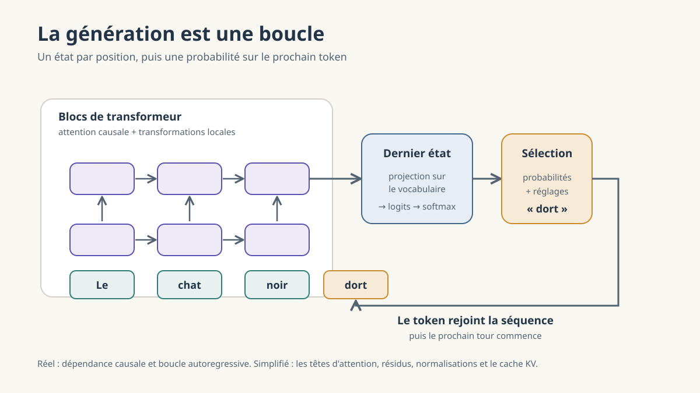

# L'espace latent

## Un terme emprunté

L'expression « espace latent » ne vient pas des modèles de langage. Elle vient des architectures qui compressent une entrée volumineuse en une représentation réduite, autoencodeurs, modèles de diffusion, où existe un véritable goulot d'étranglement. Dans un transformeur, il n'y a pas de compression de ce type. La dimension des vecteurs reste la même du début à la fin du calcul.

Le terme s'est étendu par analogie à toute représentation interne non lisible directement. L'usage est répandu, mais il vaut mieux savoir ce qu'il recouvre ici : un espace de représentation, pas un espace comprimé.

> **Précision.** Latent ne signifie pas invisible. Les nombres sont parfaitement accessibles, on peut les afficher. Ce qui manque n'est pas l'accès, c'est l'interprétation. Aucune colonne ne porte d'étiquette. Rien n'indique que la dimension 317 correspondrait à quoi que ce soit de nommable.

## De la matrice à l'espace

Le point de départ a déjà été décrit. La matrice de plongement comporte une ligne par token du vocabulaire, chaque ligne étant une suite de quelques milliers de nombres. Ces nombres sont des coordonnées.

Un espace apparaît dès que l'on cesse de lire ces lignes une par une pour les considérer ensemble, dans un même repère. Cent mille lignes deviennent cent mille points placés dans un espace de quelques milliers de dimensions. La matrice donne les coordonnées, l'espace rassemble les positions, la géométrie rend leurs relations calculables.

Cet espace initial a une propriété qu'il faut noter : il est fini et discret. Il ne contient que les points du vocabulaire, un par token, et rien entre eux. C'est un semis de points, pas un continuum peuplé.

## Ce que la carte organise

Dans cet espace, la position absolue d'un point n'a pas de signification. Deux modèles entraînés sur les mêmes données produisent des cartes différentes, sans que l'une soit plus juste que l'autre. Ce qui compte est le voisinage et les directions.

Les représentations de *chat*, *chien* et *lapin* tendent à se retrouver proches, tandis que *moteur*, *piston* et *carburateur* forment un autre voisinage. La proximité n'enregistre pourtant pas une parenté de sens, elle enregistre une parenté d'emploi. Les deux se confondent souvent, mais pas toujours, et c'est là que la carte devient instructive.

*Chaud* et *froid* sont voisins. *Toujours* et *jamais* aussi. Ces couples apparaissent dans les mêmes phrases, aux mêmes places, avec les mêmes mots autour. Un espace construit sur la distribution des contextes rapproche donc des mots que le sens oppose. La carte organise l'usage, pas la signification.

## Pourquoi parler d'espace

Parce qu'on y calcule. On peut mesurer une distance, chercher les plus proches voisins, comparer deux directions, regrouper des points, additionner et soustraire des vecteurs. Ces opérations sont possibles, mais elles ne se valent pas toutes.

En pratique, on compare surtout des orientations, au moyen de la similarité cosinus, plutôt que des distances au sens usuel. En grande dimension, les distances euclidiennes se concentrent : presque tous les points finissent par sembler également éloignés, et la notion de proximité perd de sa netteté. L'intuition tirée d'un plan ne se transporte pas telle quelle dans un espace à quatre mille dimensions.

Il faut ajouter que les nuages de points qu'on rencontre dans les articles et les diaporamas sont des projections. Réduire quelques milliers de dimensions à deux suppose de jeter presque toute l'information. Ces figures montrent une ombre, pas l'objet.

> **Ne pas conclure trop vite.** L'existence de directions interprétables, genre, temps verbal, registre, polarité, est une régularité approximative et non une propriété garantie. Aucune direction n'a été prévue, aucune n'est exacte, et une même relation n'est pas portée par la même direction d'un modèle à l'autre.

## Un espace ou plusieurs

Le singulier est trompeur. Quatre choses au moins sont désignées par le même terme.

1. **L'espace des plongements.** Celui de la matrice. Un point par token du vocabulaire, indépendamment de toute phrase. Il est stocké dans les poids du modèle et ne change plus après l'entraînement.
2. **Les représentations contextuelles.** Le vecteur d'un token est déplacé en fonction des autres tokens de la phrase. Ces vecteurs n'existent que le temps du calcul, ils ne sont enregistrés nulle part.
3. **Les états successifs des couches.** Chaque couche produit une nouvelle représentation à partir de la précédente. Ces états partagent la même dimension, ce qui autorise à parler d'un espace unique parcouru, mais rien ne garantit que les régularités observées dans l'un se retrouvent dans l'autre.
4. **L'espace de sortie.** La dernière représentation est confrontée aux lignes du vocabulaire pour attribuer un score à chaque token possible, score converti ensuite en probabilité.

Le quatrième point boucle la série. Le vecteur final est comparé, un par un, à des vecteurs de tokens du même type que ceux de départ. Dans plusieurs modèles, c'est d'ailleurs la matrice de plongement elle-même qui sert à cette comparaison, employée en sens inverse. La carte qui donnait au token son point de départ sert alors de règle de mesure à l'arrivée.

## Ce qui traverse les couches

Une confusion fréquente consiste à imaginer qu'un vecteur unique parcourt le modèle, en accumulant progressivement le sens de la phrase. Ce n'est pas le cas. Ce qui traverse les couches, c'est l'ensemble des vecteurs, un par token, qui montent en parallèle.

*Après « Le chat noir », il existe un vecteur par position à chaque étage. Les flèches horizontales figurent l'attention, les flèches verticales la transformation propre à chaque position.*

À l'entrée, la phrase donne autant de vecteurs qu'elle compte de tokens. Ce nombre ne change plus. À la dernière couche, il y a toujours trois vecteurs pour trois tokens. Rien n'est fusionné en cours de route, la phrase n'est pas comprimée peu à peu en une représentation unique.

Deux mouvements se combinent à chaque étage.

Le mouvement vertical appartient à chaque position séparément. Le vecteur de la troisième position est transformé, puis retransformé, sans jamais changer de colonne.

Le mouvement horizontal est l'échange. À chaque couche, une position peut consulter celles qui la précèdent et absorber une part de leur contenu. C'est le seul endroit où les colonnes communiquent. La figure ne représente que les échanges entre voisines immédiates, par lisibilité, mais chaque position consulte en réalité toutes les précédentes.

C'est cet échange, répété à chaque couche, qui fait dériver le contenu des colonnes. En bas, la troisième colonne, c'est *noir*. En haut, ce n'est plus *noir*, c'est ce que devient *noir* après avoir vu *Le* et *chat*. Les étiquettes ne disparaissent pas de la figure par commodité graphique, elles cessent d'être valables.

Rien de particulier ne se produit dans la dernière colonne. Elle traverse les couches comme les autres. Sa seule spécificité tient à l'ordre de lecture : elle est la seule à avoir eu accès à tout le texte, puisqu'une position ne regarde jamais vers la droite. C'est donc son vecteur, tout en haut, que l'on compare au vocabulaire. Les deux autres colonnes ont bel et bien été calculées jusqu'au sommet, mais on ne les lit pas au moment de générer.

### Encart. De l'état interne au token choisi

Après avoir traité la phrase, le modèle dispose, à la dernière position, d'un vecteur de sortie de dernière couche, par exemple 4 096 nombres. Aucune de ces dimensions ne désigne un mot. C'est encore une représentation sans étiquettes.

Ce vecteur est ensuite comparé, une par une, aux lignes de la matrice de sortie, qui comporte une ligne par token du vocabulaire. Chaque comparaison produit un nombre, le score de ce token. Si le vocabulaire compte cent mille entrées, on obtient cent mille scores. Cette fois, chaque dimension porte un nom.

Après le contexte « Le chat », le modèle produirait par exemple :

| Token possible | Score |
| --- | ---: |
| dort | 8,2 |
| mange | 6,1 |
| noir | 4,9 |
| girafe | -1,3 |

Ces scores sont appelés logits. Ce ne sont pas des probabilités. Ils peuvent être négatifs et leur somme n'a aucune raison de valoir 1. Une fonction, la softmax, les convertit en une distribution :

| Token possible | Probabilité |
| --- | ---: |
| dort | 42 % |
| mange | 18 % |
| noir | 7 % |
| tous les autres | 33 % |

Le changement n'est pas un passage vers un espace plus riche ou plus sémantique. C'est un changement de question. Le vecteur interne décrit l'état du calcul à cette position. Le vecteur de sortie mesure la compatibilité de chaque token du vocabulaire avec cet état. Le premier est sans étiquettes, le second n'est fait que d'étiquettes.

Le token retenu est ensuite ajouté au texte, et l'ensemble repasse dans le modèle. Un nouveau parcours commence.

> **Précision.** Les valeurs ci-dessus sont fictives et servent l'illustration. Le token retenu n'est d'ailleurs pas toujours le plus probable : la procédure de sélection introduit une part de tirage aléatoire, réglable.

## Avocat, de nouveau

Le mot *avocat* reçoit la même ligne de la matrice dans les deux phrases suivantes.

- « L'avocat plaide devant le tribunal. »
- « L'avocat est mûr et crémeux. »

Le vecteur initial est identique, non pas approximativement, mais exactement, puisqu'il s'agit du même identifiant et donc de la même ligne de la matrice. Ce qui diffère se construit ensuite. Au fil des couches, les deux occurrences s'éloignent l'une de l'autre, jusqu'à occuper des régions distinctes.

Une nuance, qui ne change rien à l'idée : avant la première couche, une information de position est ajoutée au vecteur, de sorte que le modèle sache si le token est le premier, le deuxième ou le dixième. Deux occurrences du même token à des places différentes n'entrent donc pas tout à fait à l'identique dans le calcul. La ligne du vocabulaire, elle, reste la même.

La matrice donne un point de départ commun. Le contexte sépare les trajectoires.

## Une formulation simple

L'espace latent est la carte que le modèle s'est construite pour organiser les ressemblances, les différences et les relations d'emploi présentes dans ses données.

Ce n'est ni une base de connaissances ordonnée, ni un monde intérieur que le modèle contemplerait. C'est un système de coordonnées, sans étiquettes, dont la première version est fixée dans la matrice de plongement et dont les suivantes ne durent que le temps d'un calcul.

## Les termes exacts

Le texte s'appuie sur des images. Elles rendent service, mais elles ne sont pas le vocabulaire du domaine. Voici la correspondance, pour qui voudra lire ailleurs.

| Image employée ici | Terme exact | Précision utile |
| --- | --- | --- |
| Une ligne du grand tableau | Vecteur de plongement, ou embedding | Une ligne de la matrice de plongement, une par token du vocabulaire |
| La place dans la phrase | Position | Le rang du token dans la séquence, ajouté au vecteur avant la première couche par l'encodage de position |
| Un étage | Une couche, ou bloc de transformeur | Un modèle courant en compte de quelques dizaines à une centaine |
| Une colonne qui monte | Flux résiduel | Le fil de calcul propre à une position, que chaque couche modifie sans le remplacer |
| Le contenu d'une case | Représentation contextuelle, ou état caché | Calculée à la volée, jamais stockée dans le modèle |
| L'échange horizontal | Attention | Le seul mécanisme par lequel les positions communiquent |
| Ne jamais regarder à droite | Attention causale, ou masque causal | Propriété des modèles génératifs, qui ne vaut pas pour tous les transformeurs |
| Le nombre de nombres par vecteur | Dimension du modèle, notée d | De l'ordre de quelques milliers |
| Comparer au vocabulaire | Projection de sortie, ou unembedding | Un score par token, souvent obtenu avec la matrice de plongement transposée |
| Les scores | Logits | Valeurs réelles, positives ou négatives, sans contrainte de somme |
| La conversion en pourcentages | Softmax | Produit une distribution de probabilité sur tout le vocabulaire |
| Le choix du mot suivant | Échantillonnage | Réglable, par la température et par des filtres sur les candidats |

Deux réserves sur ce tableau. La première : « espace latent » n'y figure pas, faute de définition stable. Selon les auteurs, il désigne l'espace des plongements, celui d'une couche donnée, ou l'ensemble des représentations internes. Mieux vaut préciser à chaque emploi de quoi l'on parle. La seconde : ces termes décrivent des objets de calcul, pas des facultés. Dire qu'une position « consulte » ou « absorbe » reste une commodité de langage, utile en formation, à condition de le signaler.
