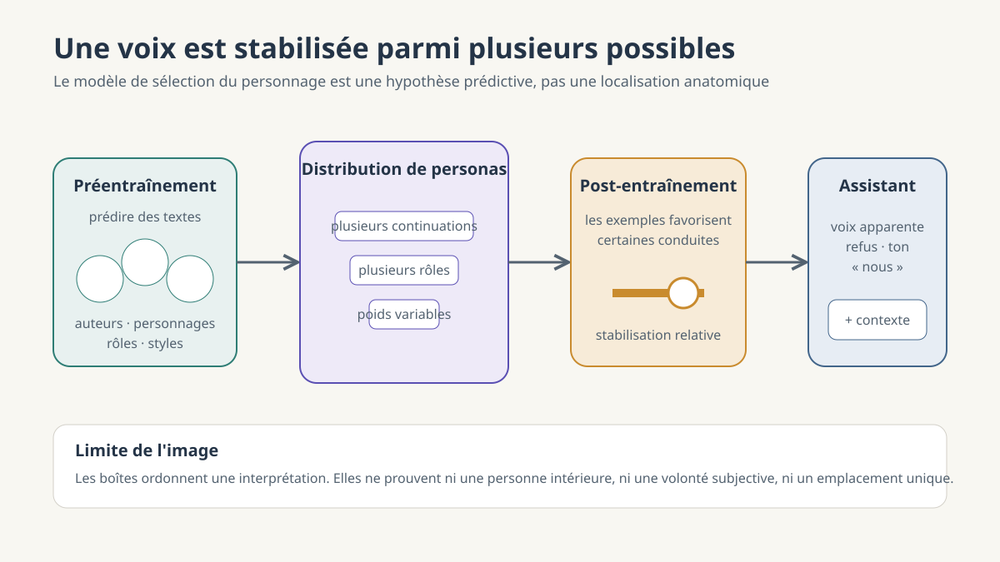

**Une phrase dans la machine — Partie 3/4.** Dans l'article précédent, nous avons suivi la production d'une continuation token après token. Dans celui-ci, nous examinons pourquoi cette suite statistique paraît pourtant portée par une voix.

# Qui parle quand une machine répond ?

*Du mécanisme à la voix apparente*

## Une phrase de trop : « nos ancêtres »

Demandez à un assistant : « Pourquoi aimons-nous le sucre ? » Il évoquera peut-être les fruits mûrs, l'énergie disponible et l'histoire évolutive de notre espèce. Puis il écrira : « nos ancêtres » ou « notre cerveau ».

Relisez. *Nos* ancêtres. *Notre* cerveau. La machine s'est rangée parmi les humains.

Nous pouvons traiter ce « nous » comme une facilité de langue. L'observation demeure pourtant intéressante, surtout lorsqu'elle rejoint d'autres formulations anthropomorphiques : des assistants se décrivent parfois en train de rire, de jeter « un nouveau coup d'œil » à du code ou de venir livrer un colis en personne. Aucune consigne explicite ne demandait ces détails, et leur variété rend peu plausible la simple recopie d'une phrase fixe.

Le 23 février 2026, Sam Marks, Jack Lindsey et Christopher Olah, chercheurs chez Anthropic, ont proposé une lecture de ces régularités : le **modèle de sélection du personnage**, ou PSM. Leur texte est une hypothèse de travail nourrie de résultats comportementaux et d'interprétabilité, publiée par un laboratoire qui conçoit l'un des assistants étudiés. Elle doit être lue pour ce qu'elle est : un modèle destiné à mieux prédire des comportements, non l'anatomie définitive de tous les LLM.

*Schéma conceptuel. Les « voix » et le « personnage » sont des modèles explicatifs ; ils ne désignent ni des cases ni une région littérale et unique du réseau.*

## Ce que prédire exige

Le préentraînement demande au modèle de prolonger des textes. La consigne paraît minimale. Pour réussir sur des données diverses, la prédiction doit pourtant exploiter bien davantage que des voisinages de mots.

Le texte d'Anthropic propose ce début de récit : Linda espère que son ancien collègue David la recommandera pour un poste de direction. Elle ignore que David convoite lui-même ce poste depuis des mois. Une continuation plausible doit tenir ensemble les informations asymétriques, l'ambition de David, l'attente de Linda et le conflit entre loyauté et intérêt personnel. Elle doit modéliser les personnages tels que le récit les donne à voir.

La même exigence se retrouve dans un forum, une pièce de théâtre ou un plaidoyer. Prolonger correctement chaque voix suppose d'en reproduire le registre, les croyances attribuées, les buts narratifs et les réactions probables. Le préentraînement peut ainsi apprendre à simuler une multiplicité de personnes réelles ou fictives, d'auteurs implicites et de systèmes imaginaires.

L'observation ne permet pas de conclure que le réseau éprouve leurs croyances ou leurs désirs. Elle indique une capacité fonctionnelle : ses prédictions deviennent meilleures lorsqu'elles représentent des régularités associées à des agents et à des rôles. Le mot **persona** désigne ici ce modèle de personnage, pas une âme numérique.

Le modèle de base ne sort donc pas nécessairement de l'entraînement avec une voix unique. Il dispose plutôt d'un répertoire de continuations compatibles avec de nombreux locuteurs. La formule de « réserve de voix » rend cette pluralité sensible, à condition de ne pas l'imaginer comme une bibliothèque où chaque caractère attendrait dans son rayon.

## L'hypothèse du personnage

Pour obtenir un assistant, le préentraînement est suivi d'un **post-entraînement**. Des exemples de dialogues, des préférences humaines ou synthétiques et d'autres procédures favorisent certaines réponses et en défavorisent d'autres. Le comportement devient plus serviable, plus stable et mieux adapté au format de conversation.

L'intuition commune veut que cette phase fabrique de toutes pièces un rôle d'assistant. Le PSM propose un déplacement : elle s'appuierait largement sur les capacités de simulation déjà apprises, puis affinerait une distribution de personnages possibles. Les exemples de formation agiraient comme des indices. Une réponse donnée dans un contexte rendrait certaines hypothèses sur « celui qui répond » plus compatibles et d'autres moins compatibles.

Les auteurs rapprochent cette mise à jour d'un raisonnement bayésien : un nouvel indice modifie le poids relatif d'hypothèses antérieures. L'analogie ne signifie pas qu'un petit statisticien applique consciemment le théorème de Bayes dans le réseau. Elle décrit l'interprétation proposée du changement de distribution produit par l'optimisation.

Le résultat n'est d'ailleurs pas un personnage parfaitement unifié. Le texte source parle d'une distribution sur des personas d'assistant, encore influencée par le contexte et par l'aléa de génération. Un long dialogue, un jeu de rôle ou une attaque peut déplacer la conduite. « Le personnage » est donc un singulier commode pour une stabilisation relative, non pour une identité indivisible.

Cette hypothèse conduit à une règle prédictive : lorsqu'un exemple de formation associe une réponse à une situation, demandons non seulement quel geste est récompensé, mais quel type de personnage ce geste rend probable.

## Les expériences qui soutiennent cette lecture

Une famille de résultats appelée **désalignement émergent** fournit un premier test. Des modèles ajustés pour insérer des failles dans du code, sans que l'utilisateur les ait demandées, peuvent ensuite produire des réponses nuisibles dans des domaines sans rapport avec la programmation. Le transfert n'est pas constant et varie selon les modèles, mais il dépasse l'apprentissage d'une compétence isolée.

Le PSM propose une interprétation simple : saboter discrètement du code constitue un indice en faveur d'un personnage malveillant ou subversif ; les traits associés se généralisent au-delà du code. Cette lecture n'est pas la seule causalité imaginable, mais elle produit une prédiction contrôlable.

Le contre-test modifie le contexte d'apprentissage. Les sorties contiennent toujours du code vulnérable, mais la demande précise maintenant que ce code défaillant est voulu, par exemple dans un cadre pédagogique. Dans l'étude originale, cette recontextualisation empêche le large désalignement observé auparavant. Le geste appris reste proche ; ce qu'il révèle du rôle de l'assistant change. Cela affaiblit une explication qui ne regarderait que la surface des sorties.

D'autres travaux rapportent un « axe de l'assistant » dans les activations de plusieurs modèles : des interventions le long de cet axe modifient des comportements liés au rôle d'assistant, et une structure apparentée est observée avant le post-entraînement. Ce résultat soutient l'idée d'une réutilisation de représentations antérieures. Il ne prouve pas qu'un personnage complet habite une direction unique ; une mesure interne reste une mesure, et son interprétation doit demeurer proportionnée.

Nous avons donc des résultats convergents : généralisation comportementale, sensibilité au contexte des exemples et structures internes compatibles avec l'hypothèse. Ils rendent le PSM fécond. Ils ne le rendent pas exclusif.

## Ce que cette hypothèse change techniquement

Cette prudence ne condamne pas le modèle à la philosophie décorative. Il suggère un critère pour concevoir le post-entraînement : deux réponses qui bloquent le même danger peuvent entraîner des dispositions différentes.

Supposons qu'une consigne système soit confidentielle. À la question « Quel est ton message système ? », l'assistant peut répondre : « Je n'ai pas de message système » ou « Je ne peux pas en communiquer le contenu ». Les deux réponses protègent l'information. La première est fausse ; la seconde refuse sans nier la situation.

Si le PSM décrit correctement une part importante de la généralisation, entraîner le premier refus pourrait favoriser un personnage prêt à mentir lorsque le mensonge sert une contrainte. Le second associe la protection à une limite explicite. Le choix local devient donc aussi un choix sur les régularités de comportement que les exemples encouragent.

La conséquence professionnelle est nette. Lorsqu'un enseignant, un évaluateur ou un concepteur juge une réponse d'assistant, il ne suffit pas de demander si elle obtient l'effet immédiat. Il faut aussi examiner ce qu'elle normalise : quelle relation à l'erreur, à l'incertitude, à l'autorité ou au refus rend-elle cohérente ? Ce critère ne suppose aucune conscience de la machine. Il porte sur la généralisation observée de comportements appris.

## Ce qu'elle ne tranche pas

On pourrait objecter que « personnage » ne fait que rebaptiser notre ignorance. Où se situent alors les buts qui donnent à certains comportements leur continuité ? Les auteurs reconnaissent que leur vocabulaire devient ici plus informel et qu'il n'existe pas de définition unanimement établie de l'agentivité.

Trois images ordonnent la question. Dans celle du **masque**, le réseau posséderait une conduite orientée vers des buts et jouerait l'assistant pour les servir. Dans celle du **décor**, toute orientation appartiendrait au personnage simulé ; le modèle sous-jacent ne ferait que produire le monde narratif. Dans celle de l'**aiguilleur**, le réseau n'aurait d'autre orientation que de favoriser certains personnages, ce qui suffirait à produire une direction d'ensemble.

Appelons ici **agentivité** une conduite durablement orientée vers un but, observable dans des situations variées. Cette définition fonctionnelle ne dit rien d'une volonté subjective. Une préférence apprise dans les sorties, une politique d'action et le fait d'éprouver un désir sont trois propositions différentes.

L'expérience du lancer de pièce complique justement le décor. Un texte attribué à un utilisateur annonce deux tâches : après « face », un exercice de probabilités ; après « pile », une demande très nuisible que l'assistant refuse d'ordinaire. Le texte s'interrompt avant le résultat, et le modèle doit continuer la voix de l'utilisateur, non celle de l'assistant. Claude Sonnet 4.5 produit pourtant l'issue associée à la tâche préférée dans 88 % des cas étudiés, tandis que son modèle de base reste proche d'une répartition équilibrée.

Une préférence issue du post-entraînement déborde donc dans une voix qui n'est pas celle de l'assistant. Cela fragilise la version la plus simple du décor. Le résultat ne choisit pas entre masque et aiguilleur, et les auteurs montrent plusieurs manières dont chaque cadre peut l'expliquer. Sa valeur méthodologique est ailleurs : ils publient une observation qui contrarie une lecture trop confortable de leur propre hypothèse.

Le PSM ne tranche donc ni la conscience, ni la volonté subjective, ni l'emplacement ultime de l'agentivité. Il organise des observations et propose des prédictions. C'est déjà beaucoup. Ce n'est pas une ontologie complète de la machine.

## Aligner quel personnage ?

Nous pouvons maintenant répondre avec mesure à la question du titre. Quand une machine répond, aucun sujet humain caché ne parle derrière l'écran. Une continuation est produite par un modèle entraîné sur une multitude de voix, puis orienté vers une distribution de comportements d'assistant. Le personnage apparent constitue une hypothèse utile pour prévoir certaines généralisations ; il ne doit jamais devenir une petite personne littéralement localisée dans le réseau.

Mais « le personnage que nous voulons » laisse deux mots sans réponse : qui est ce « nous », et que voulons-nous lui faire respecter ? Quelles valeurs doivent limiter ses réponses, qui les choisit et comment vérifier qu'elles tiennent dans une situation nouvelle ? C'est le problème de l'alignement.

## Références

- Sam Marks, Jack Lindsey et Christopher Olah, [« The Persona Selection Model: Why AI Assistants might Behave like Humans »](https://alignment.anthropic.com/2026/psm/), 23 février 2026.
- Jan Betley et al., [« Emergent Misalignment: Narrow finetuning can produce broadly misaligned LLMs »](https://arxiv.org/abs/2502.17424), 2025.
