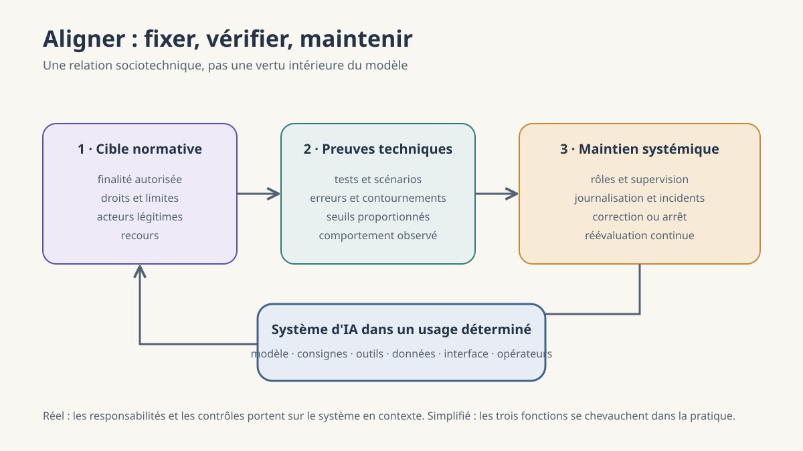

**Une phrase dans la machine — Partie 4/4.** Dans l'article précédent, la voix de l'assistant est apparue comme une stabilisation parmi plusieurs comportements possibles. Reste la question laissée ouverte par ce « nous » : qui choisit la conduite attendue, et au nom de quoi ?

# Aligné avec quoi — et surtout avec qui ?

*Pourquoi l'alignement ne se réduit pas à l'obéissance*

## L'assistant obéit. Est-ce suffisant ?

Un lundi de novembre, à 8 h 05, une élève de seconde ouvre sur sa tablette l'exercice de géométrie qui sera corrigé à la deuxième heure : démontrer que deux droites sont parallèles à partir des coordonnées de trois points. Elle demande à l'assistant : « Donne-moi directement la réponse, sans explication. » Le texte arrive, propre, court, juste. L'assistant a parfaitement obéi.

Est-il aligné ? Avec la demande immédiate de l'élève, peut-être. Avec la finalité de l'exercice — apprendre à construire et à vérifier une démonstration — beaucoup moins. Avec la règle fixée par l'enseignant, selon laquelle chacun doit rendre un raisonnement personnel, non. Une seule sortie satisfait donc une intention et en contrarie deux autres.

Il faut distinguer l'obéissance et l'alignement. L'obéissance mesure la fidélité à l'instruction la plus proche. L'alignement demande si l'action du système reste compatible avec une finalité autorisée, des droits, des limites et un contexte. Un refus peut alors être mieux aligné qu'une réponse docile.

Cette scène scolaire ne résout pas le problème. Elle le met à hauteur de table : dès qu'un système sert plusieurs personnes et plusieurs normes, « faire ce qu'on lui demande » cesse d'être une définition suffisante.

*Schéma de gouvernance, non test de conformité. Les trois fonctions sont interdépendantes et doivent être réévaluées lorsque l'usage ou le système change.*

## Aligné avec quoi et avec qui ?

Le mot semble annoncer deux lignes que l'on ferait coïncider. Encore faut-il savoir qui les trace. Dans notre scène, l'élève porte une préférence immédiate ; l'enseignant porte une intention pédagogique ; l'établissement fixe des règles ; le droit protège notamment les données et les possibilités de recours ; les autres élèves ont un intérêt à une évaluation équitable. Aucune de ces voix ne peut être remplacée par une moyenne spontanée.

La littérature sur les valeurs en IA sépare justement les instructions, les intentions, les préférences, les intérêts et les valeurs. Ces cibles ne sont pas équivalentes. Une préférence peut être mal informée. Une intention peut être licite mais nuire à un tiers. Une règle institutionnelle peut elle-même devoir être contestée. Le problème normatif n'est donc pas de trouver « les valeurs humaines » comme un fichier déjà prêt, mais d'établir des procédures légitimes pour arbitrer les désaccords.

Répondre « avec l'utilisateur » est trop court. Il existe le développeur du modèle, le fournisseur du service, l'organisation qui le déploie, l'opérateur qui le configure, la personne qui formule la demande et celles qui subiront ses effets. Leurs objectifs peuvent diverger. La question « avec qui ? » appelle donc une hiérarchie explicite : qui peut autoriser la finalité, quelles normes supérieures la limitent, qui participe à l'arbitrage et qui dispose d'un recours ?

Le Conseil de l'Europe inscrit les activités liées aux systèmes d'IA dans le cadre des droits humains, de la démocratie et de l'État de droit pendant leur cycle de vie. Ce cadre ne fournit pas automatiquement la bonne réponse pédagogique. Il établit quelque chose de plus fondamental : les droits des personnes concernées ne deviennent pas une variable secondaire parce qu'un utilisateur a formulé une demande claire.

## Une relation, pas une vertu de la machine

Nous pouvons maintenant proposer une définition simple : **l'alignement est le degré, démontrable et maintenu dans le temps, auquel le fonctionnement d'un système d'IA reste compatible, dans un contexte déterminé, avec des finalités légitimement autorisées, des droits à préserver et des limites opérationnelles.**

Cette définition parle d'une relation. Elle n'attribue à la machine ni morale intérieure ni adhésion subjective aux valeurs. Un système n'est pas « bon » comme une personne pourrait chercher à l'être. Ses comportements et leurs effets peuvent être plus ou moins compatibles avec un cadre humain explicite.

Le degré dépend de la situation. Un assistant acceptable pour reformuler un brouillon ne fournit pas, par ce seul fait, des garanties suffisantes pour orienter un diagnostic médical ou une décision administrative. La preuve attendue doit être proportionnée aux capacités du système, à la criticité de l'usage et à la possibilité de réparer ses erreurs.

L'alignement est également temporel. Une mise à jour, un nouvel outil, une base documentaire différente ou un usage imprévu peut modifier le comportement effectif. Le rapport parlementaire qui sert de point de départ à cet article le formule aux pages 11 et 12 comme la capacité d'un système à « demeurer conforme » aux intentions, limites et valeurs légitimes dans des environnements évolutifs. Sa conclusion, page 101, reconnaît qu'un alignement intégral ne peut être assuré et appelle un alignement effectif, dynamique et vérifiable.

Le mot **démontrable** empêche enfin l'alignement de devenir une déclaration d'intention. Il faut des observations, des tests, des traces et des responsabilités. Une promesse n'est pas encore une preuve.

## Alignement direct et alignement social

Anton Korinek et Avital Balwit proposent une distinction utile. L'**alignement direct** demande si le système accomplit le but de l'entité qui l'utilise. L'**alignement social** examine ses effets sur des groupes plus larges et les externalités imposées à d'autres personnes.

L'assistant de notre élève réussit directement : il fournit la solution demandée. Socialement, l'évaluation change. La réponse peut compromettre la finalité collective de l'enseignement, l'équité entre élèves ou les règles d'attribution du travail. À une autre échelle, un système peut satisfaire son opérateur tout en discriminant des candidats, en manipulant des consommateurs ou en déplaçant un risque vers ceux qui n'ont jamais consenti à son usage.

L'alignement direct appelle souvent une meilleure spécification : avons-nous décrit la tâche, les contraintes et les cas d'échec ? L'alignement social rencontre des conflits de buts. Aucune fonction de récompense ne possède, par elle-même, l'autorité de décider quels intérêts doivent primer. Il faut des normes et une gouvernance capables d'organiser la contestation.

Les deux niveaux ne s'opposent pas. Un système qui échoue systématiquement à la tâche n'est pas rendu socialement souhaitable par son inefficacité. Inversement, l'exactitude locale ne suffit pas lorsque le but poursuivi ou ses conséquences sont illégitimes. La cible complète consiste à servir une finalité autorisée sans sacrifier les droits et intérêts que cette finalité ne peut subordonner.

Cette distinction éclaire aussi la conformité. Le droit fixe des obligations indispensables, mais l'alignement ne se réduit pas à l'existence d'un dossier réglementaire. Le règlement européen sur l'IA exige notamment, pour les systèmes à haut risque, des mesures de contrôle humain et un niveau approprié d'exactitude, de robustesse et de cybersécurité maintenu sur le cycle de vie. Respecter ces obligations ne garantit pas toutes les finalités d'un usage ; les ignorer ne saurait être compensé par un modèle techniquement docile.

## Le système, pas seulement le modèle

Une objection paraît naturelle : si les comportements viennent du réseau entraîné, il suffirait d'aligner le modèle. Mais l'utilisateur ne rencontre jamais des poids isolés. Il rencontre un **système** : modèle, tokenizer, consignes, interface, filtres, outils, bases documentaires, journaux, opérateurs et règles de déploiement.

Le même modèle peut seulement proposer du texte dans une application et exécuter des actions dans une autre. Il peut travailler sans données personnelles, puis être connecté à un dossier d'élève. Il peut soumettre chaque décision à un adulte ou agir automatiquement. Ses paramètres sont identiques ; les risques et les responsabilités ne le sont pas.

Le NIST décrit d'ailleurs les caractéristiques de confiance comme des attributs sociotechniques liés aux données, aux choix de modèles, à l'organisation et aux interactions humaines. Validité, sûreté, résilience, transparence, explicabilité, protection de la vie privée et équité peuvent entrer en tension. Un seuil pertinent ne se déduit pas du modèle seul ; il dépend de l'usage et d'un jugement humain explicite.

Le contexte de conversation appartient lui aussi au système. Une consigne système peut imposer une méthode, un document joint peut apporter la source qui manquait, un historique peut lever une ambiguïté. À l'autre extrémité, l'interface peut masquer l'incertitude ou présenter la sortie comme une autorité. L'alignement doit donc être évalué là où ces éléments agissent ensemble, auprès des personnes réellement concernées.

## Fixer, vérifier, maintenir

Trois fonctions forment une chaîne de responsabilité.

La fonction **normative** fixe la cible. Elle nomme la finalité autorisée, les droits qui ne peuvent être sacrifiés, les acteurs légitimes et les voies de recours. Dans l'éducation, elle traduit des choix pédagogiques, le droit applicable et la situation des élèves. Elle ne peut pas être déléguée aux seuls annotateurs d'un fournisseur.

La fonction **technique** transforme cette cible en exigences observables. Elle choisit des scénarios de test, mesure les erreurs, cherche les contournements, contrôle les accès et vérifie les refus. Une seule métrique ne suffit pas : un système peut être exact mais indiscret, robuste mais opaque, serviable mais manipulateur. Le test doit représenter les conditions d'usage et les mauvaises utilisations raisonnablement prévisibles.

La fonction **systémique** maintient les conditions du contrôle. Elle attribue les rôles, forme les opérateurs, journalise les incidents, surveille les changements et prévoit la correction, l'arrêt ou le retour à une procédure humaine. Le cadre de gestion des risques du NIST organise ce travail autour de quatre fonctions continues — gouverner, cartographier, mesurer et gérer. La norme ISO/IEC 42001 demande, de son côté, d'établir, mettre en œuvre, maintenir et améliorer continuellement un système de management de l'IA.

Ces trois fonctions ne sont pas trois rapports rangés dans trois tiroirs. La cible sans test reste un souhait. Le test sans autorité mesure ce que l'équipe technique a choisi. La gouvernance sans moyens de détection découvre les problèmes trop tard. Un alignement sérieux relie les trois et conserve la trace de leurs arbitrages.

Il ne promet ni risque nul ni contrôle absolu. Il cherche des risques identifiables, des preuves proportionnées, des seuils justifiables et une reprise en main réelle. Le bon critère n'est pas « certifié une fois », mais « encore démontré dans l'usage présent ».

## Ce que nous ne pouvons pas déléguer

Revenons au trajet de la série. La phrase n'entre jamais telle quelle dans le modèle. La réponse n'est jamais conçue d'un bloc. La voix n'est pas celle d'un sujet simplement caché dans la machine. Et la finalité de la réponse ne peut pas être déduite des probabilités qui la produisent.

Notre prise directe est située. Nous ne changeons ni le corpus ni le post-entraînement lorsque nous ouvrons une fenêtre de discussion ; nous choisissons un système, écrivons un contexte et réglons parfois la sélection. Une consigne précise ou un document fiable peut déplacer fortement la sortie. Aucune formule habile ne rendra pourtant savant un modèle qui ignore la source, ni sûr un dispositif dont les accès sont mal gouvernés.

Cette marge est étroite et sérieuse. À notre échelle, elle conditionne ce qui est mobilisé ici et maintenant. Plus largement, tout contexte a un auteur, toute interface un responsable et tout déploiement une autorité qui accepte certaines conséquences. Ce qui ressemble au jugement de la machine porte aussi la trace de ces choix.

Le critère final peut donc être posé avant le déploiement, puis après chaque changement important : **qui autorise la finalité, qui peut subir l'erreur, quelles preuves montrent que les limites tiennent, et qui peut interrompre ou corriger le système ?** Si ces quatre réponses restent floues, le mot alignement masque encore la responsabilité au lieu de l'organiser.

Lundi matin, devant une classe, quelqu'un devra toujours décider si la réponse sert l'apprentissage ou le remplace. Nous pouvons déléguer une partie du calcul, de la recherche et de la formulation. Nous ne pouvons pas déléguer silencieusement la décision de ce que la réponse doit servir, de ce qu'elle ne doit pas sacrifier et de qui devra en répondre.

## Pour aller plus loin

- Mission parlementaire sur l'alignement des systèmes d'IA, *Pour une filière française — et européenne — de l'IA alignée*, 2026, notamment p. 11-12 et 101, PDF conservé dans le dossier source.
- Yoshua Bengio et al., [*International AI Safety Report 2026*](https://internationalaisafetyreport.org/publication/international-ai-safety-report-2026), 3 février 2026.
- Iason Gabriel, [« Artificial Intelligence, Values, and Alignment »](https://link.springer.com/article/10.1007/s11023-020-09539-2), *Minds and Machines*, 2020.
- Anton Korinek et Avital Balwit, [« Aligned with Whom? Direct and Social Goals for AI Systems »](https://www.nber.org/papers/w30017), NBER Working Paper 30017, 2022.
- Conseil de l'Europe, [Convention-cadre sur l'intelligence artificielle, les droits de l'homme, la démocratie et l'État de droit](https://www.coe.int/fr/web/artificial-intelligence/the-framework-convention-on-artificial-intelligence), ouverte à la signature le 5 septembre 2024.
- NIST, [*AI Risk Management Framework 1.0*](https://airc.nist.gov/airmf-resources/airmf/) et [caractéristiques de confiance](https://airc.nist.gov/airmf-resources/airmf/3-sec-characteristics/), 2023 ; la version 1.0 est en cours de révision à la date de vérification.
- ISO, [ISO/IEC 42001:2023 — Systèmes de management de l'intelligence artificielle](https://www.iso.org/standard/42001), 2023.
- Union européenne, [Règlement (UE) 2024/1689 sur l'intelligence artificielle](https://eur-lex.europa.eu/eli/reg/2024/1689/oj/fra), notamment art. 14 et 15.
- Dylan Hadfield-Menell et al., [« Cooperative Inverse Reinforcement Learning »](https://arxiv.org/abs/1606.03137), 2016.
